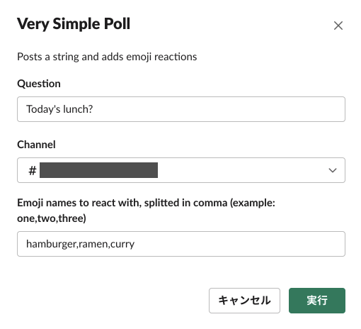
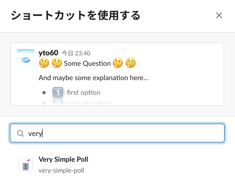
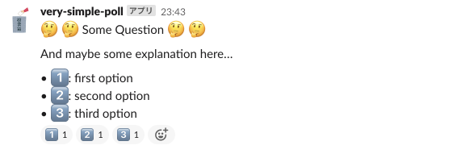

# Very Simple Poll

Very simple poll helper using emoji reactions.

[Slack Platform](https://api.slack.com/future) is required to run.

## Development

### Running it locally

```bash
slack run
```

### Deploying to Slack's Hosting

```bash
slack deploy
```

### Testing

```bash
slack deno test
```

## Usage

### Using Global Shortcut

1. Call [global shortcut](https://slack.com/help/articles/360004063011) `Very Simple Call` in your workspace.
1. Fill in the form.
    - 
1. The bot will post the poll and add reactions in order.
    - 

### Using Message Shortcut

1. Post your question to whatever channel or DM.
1. From [message shortcut](https://slack.com/help/articles/360004063011), select `Very Simple Poll`.
    - 
1. Fill in the form.
1. The bot will repost the same question and add reactions in order.
    - 
